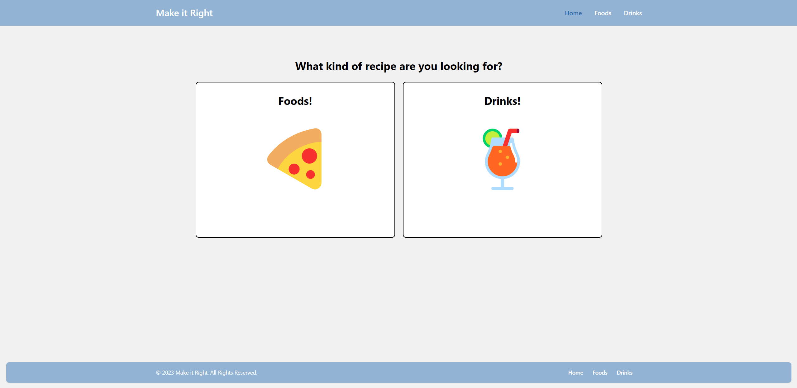
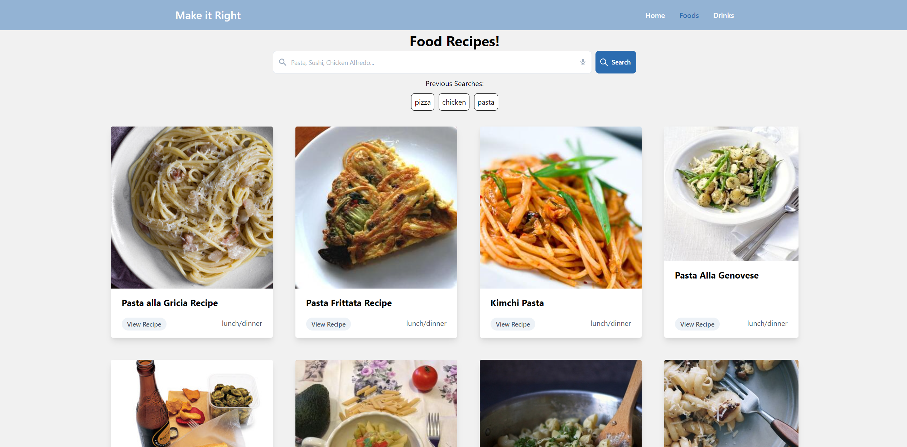
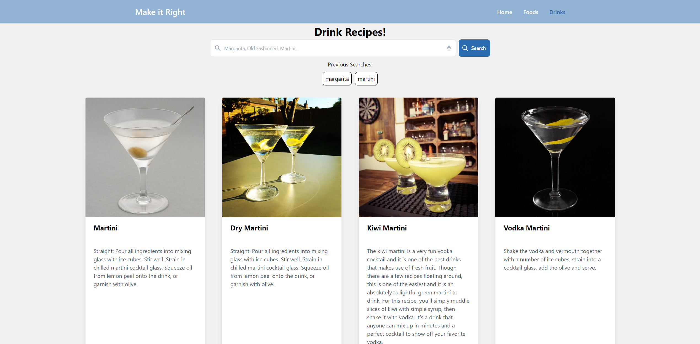

# MakeItRight

## Create meals and alcoholic drinks of your choice, using Make it Right!

## Description

Make it Right is a food and drink recipe search website that uses server side API's from [Edamam](https://www.edamam.com/) and [thecocktaildb](https://www.thecocktaildb.com) to pull in data for you wants and needs! This application was built using HTML, CSS and JavaScript. [Tailwindcss](https://v1.tailwindcss.com/) was used as a front-end framework with css to create navbars, footers, search bars, and cards. Your searches are saved in localStorage and used to create a list of most recent searches, when you click on one of those recent searches, it will research for that keyword.

## Links

[Live Site](https://zeuzh.github.io/MakeItRight/)\
[GitHub Repository](https://github.com/zeuzh/MakeItRight)

## Showcase

